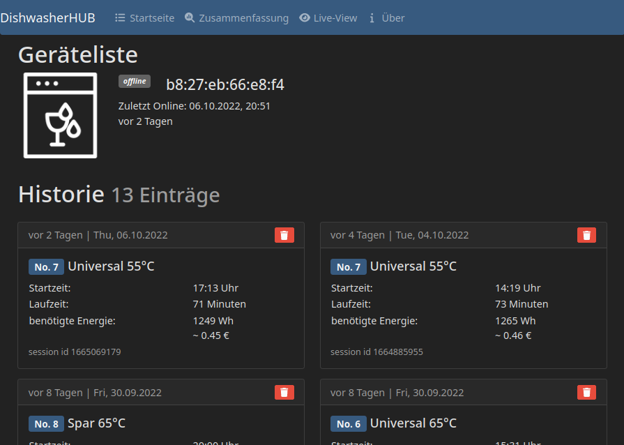
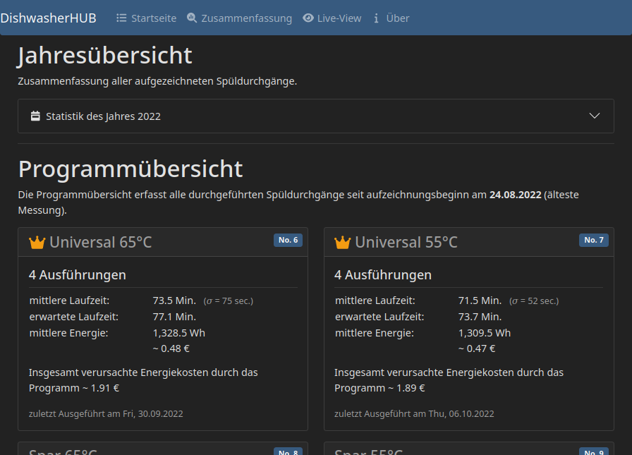
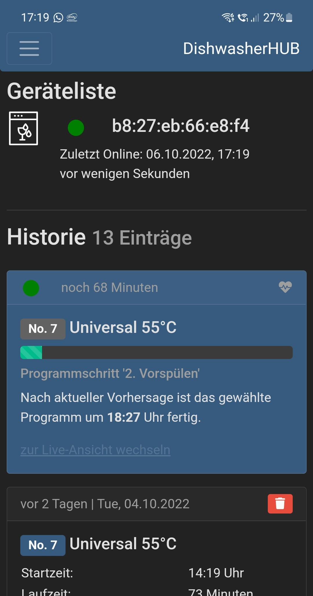
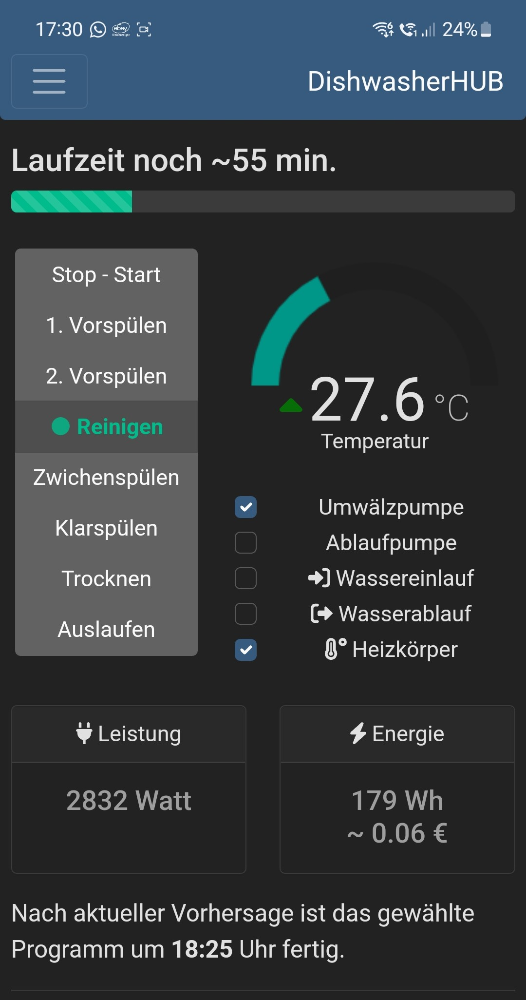

# DishwasherFrontend

Frontend application for the `SmartDishwasher` project to show runtime history, a live-view and more in-depth data analysis. The application is implemented in [Angular](https://angular.io/) using TypeScript. The whole application was designed as a Progressive Web App (PWA) to be used in the best possible way on mobile. With the use of [Bootstrap 5](https://github.com/twbs/bootstrap), the fronted is designed as a responsive web app and therefore usable on all types of devices.

> :sparkles: This is a component of the `SmartDishwasher` project. **FOR A PROJECT OVERVIEW PLEASE VISIT THE [SmartDishwaser](https://github.com/AmbroAnalog/SmartDishwasher) REPOSITORY.**

In conjunction with projects [DishwasherOS](https://github.com/AmbroAnalog/DishwasherOS) and [DishwasherBackend](https://github.com/AmbroAnalog/DishwasherBackend)

## Key Features

- Realtime communication between backend and fronted using [socket.io](https://github.com/socketio/socket.io) to be able to display live process data from the dishwasher.
- Web Push Notifications for important dishwasher wash cycle events (like start / finished).
- PWA implementation for improved page loading time and access to some native features, create an app-like user experience.
- Display database entries of all past wash cycles.
- In-depth analysis of the past washing cycles with evaluation for each washing program.
- Completely SSL encrypted connection.

## Screenshots

### Web application on Desktop device

|                   |            |
|:---------------------------------------------------------------------------------------- | ------------------------------------------------------------------------------------- |
| Home page of the web application. Overview of registered devices and past washing cyles. | In-depth analysis of the past washing cycles with evaluation for each washing program |

### Web application installed as PWA on a Android device

|  |  |
|:--------------------------------------------------------------------- | ------------------------------------------------------------- |
| Home page of the web application with a currently running wash cycle. | Live view of the currently running cycle.                     |

## Installation & Deployment

The application is deployed in a Docker environment. Installation of `docker` as well as `docker-compose` is required.
In addition to the container that hosts the Angular application via a [ngin](https://www.nginx.com/) web server, a certbot container is also started. This container is responsible for obtain cert from Let's Encrypt for an SSL encrypted web application.

1. `git clone https://github.com/AmbroAnalog/DishwasherFrontend.git`

2. install the `webpush` library: `npm install web-push -g`

3. generate a VAPID key pair with the following command:
   `web-push generate-vapid-keys --json`

4. add environment configuration file `src/environments/environment.prod.ts` and replace domain.de:
   
   ```typescript
   export const environment = {
      production: true,
      vapid_public_key: "insert generated VAPID public key here",
      api_root_url: 'https://domain.de/api/',
      socketio_root_url: 'https://domain.de/',
      socketio_path: '/live/socket.io/'
   };
   ```

5. modify the `init-letsencrypt.sh` script configuration (line 9 to 12)

6. `cp server/nginx/app.conf.template server/nginx/app.conf` and modify web server configuration

7. run the init script: `./init-letsencrypt.sh`

8. `docker-compose up -d --build`

9. :checkered_flag: your web application is now available at the domain you specified.
